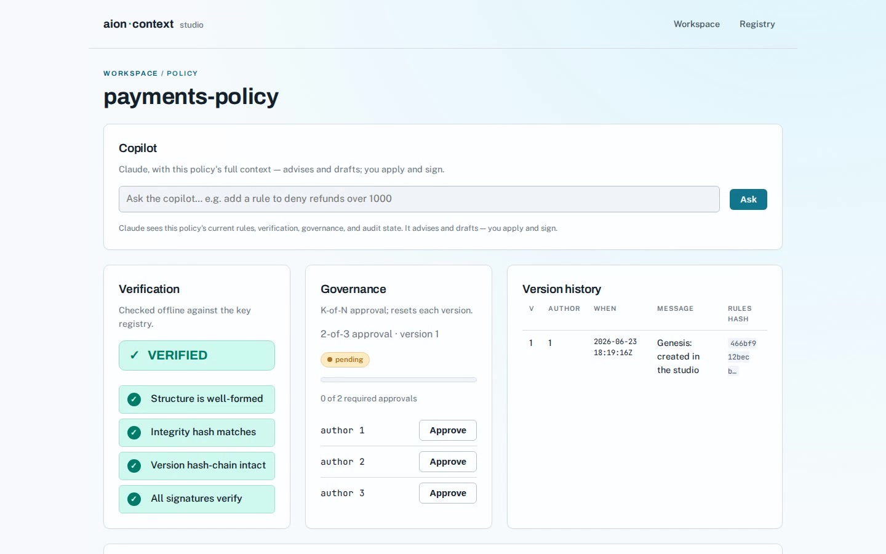

# aion-context-studio

**The studio for [aion-context](https://github.com/aion-context/aion-context) — author, govern,
verify, simulate, and audit signed `.aion` policy artifacts, with Claude as a copilot.**

aion-context turns business rules into **signed policy artifacts**: a hash-chained version history,
an Ed25519 signature per version, K-of-N multisig approval, a key registry, an embedded audit
trail, and a `verify_file` that proves four things every time — *structure · integrity ·
hash-chain · signatures*. The library and CLI exist; this is the rich UI on top.

The studio is a **rich SPA** (SvelteKit) over a **thin Rust/axum API** that wraps aion-context.
Claude is a central copilot that drafts and edits rules, explains diffs, and summarizes the audit
trail — but **Claude only advises; every cryptographic action is an explicit, human-signed
operation.** It is a reference implementation in the family of aion-trust and aion-edu.

> **Local single-operator demo — NOT a production custody architecture.** This one process holds
> the operator's own signing keys on disk and binds to loopback only. In production, keys live with
> the parties that hold them; the studio would talk to their signing services. The key registry
> never holds a secret.

## Demo

[](https://youtu.be/go-fghIWHN4)

A ~3-minute narrated tour: compose a policy in the builder, verify its four guarantees, govern it
with K-of-N approval, simulate a decision, audit and export it, and draft a rule with the Claude
copilot — every policy a signed, provable artifact. ▶ **https://youtu.be/go-fghIWHN4**

## Status

**Phases 0–6 complete** — the full studio: author and commit signed versions with a live diff,
K-of-N multisig governance, a key registry (register / rotate / revoke / epochs / trusted-JSON),
policy simulation with a decision trace, audit · compliance · export, and a context-aware Claude
copilot.

**Phase 7 (custody) complete** — the studio is custody-agnostic end to end: keys sit behind a
`KeyVault` (file vault by default, OS keyring via `STUDIO_CUSTODY=keyring`), author enumeration uses a
custody-agnostic index, the server is embeddable (`serve` / `serve_on`), and `import-keys` migrates an
existing workspace's keys into the OS keyring. The Tauri desktop **window** is deferred (it needs a
desktop toolchain to build) — scaffolded in [`tauri/`](tauri/README.md); custody model in
[`docs/CUSTODY.md`](docs/CUSTODY.md). See [`ROADMAP.md`](ROADMAP.md).

## Run it

```sh
# one process serves the API and the built SPA on http://127.0.0.1:8787
cd web && npm install && npm run build && cd ..
cargo run -p aion-studio-api
```

Dev (hot reload): `cargo run -p aion-studio-api` + `cd web && npm run dev` (Vite on :5173 proxies
`/api` to the Rust server).

## Layout

- `crates/studio-core` — the testable glue over aion-context (workspace, policies, registry, seed).
- `crates/aion-studio-api` — thin axum API; serves `/api` and the SPA.
- `web/` — the SvelteKit SPA (Archivo · Public Sans · JetBrains Mono; design context in
  [`.impeccable.md`](.impeccable.md)).

## License

MIT OR Apache-2.0.
